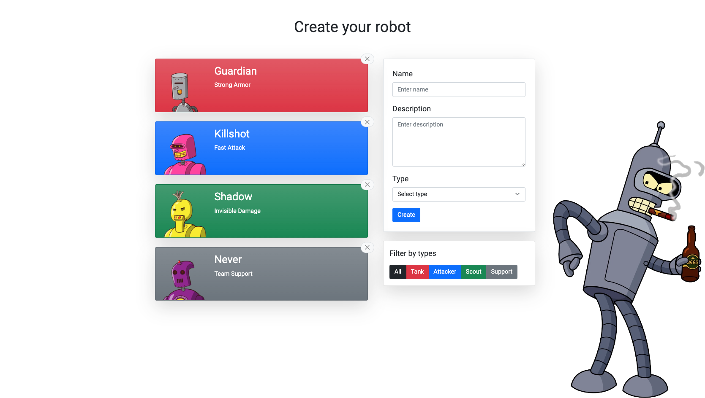

# Robot Constructor

Service for creating your own different robots

## Demo

<https://skripkaru.github.io/robot-constructor/>

## Screenshots



## Tech Stack

**Client:** React, TypeScript, Hooks, Redux, Redux-Toolkit, REST API

**Server:** JSON Server

## Features

- Adding robots
- Deleting robots
- Robot filter

## Installation

Install with yarn

```bash
  yarn install
```

Compiles and hot-reloads for development

```bash
  yarn start
```

Compiles and minifies for production

```bash
  yarn build
```
